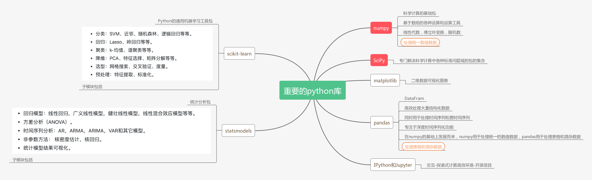

## I 前言
写了一个程序，已知每时每刻的在线人数，找到峰值所在的最大范围的时间区间；
需要一些测试用例；
想到用绘制折线图的方式，直观地用肉眼看出最大区间，当做测试用例，进行测试；
晚上跟CC语音，聊到这个问题；
了解到可以用python的2D绘图库，可以实现类似于Matlab的绘图效果。

## II 名词解释

### 1. python
python的各个版本之间的切换似乎

### 2. anaconda
python的包管理工具；
类似于mac的homebrew,ruby的gem,go的go get;

pip也是python的包管理工具，pip要一个一个包安装；
anaconda可以安装依赖；

用法：
> conda install xxx

### 3. matplotlib
python的2D绘图库

### 4. VScode
一个轻量级的IDE，通过安装插件扩展功能，可以实现各种语言，各种自定义的需求

## III 配置过程

### 1. CC口述过程
1. 安装python
2. 安装anaconda
3. 安装vscode, 安装python的插件
4. 写一个文件，运行

### 1. 参考链接

## IV 疑问
